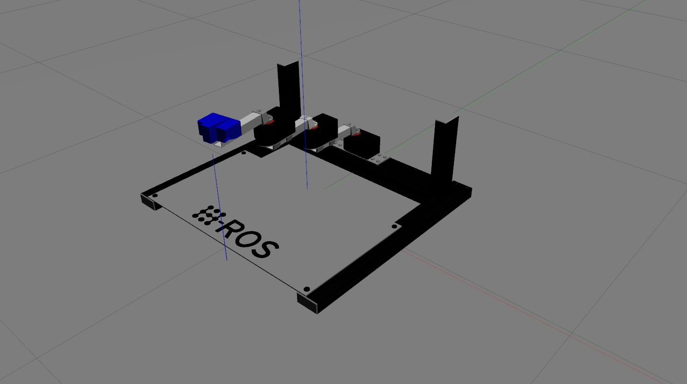
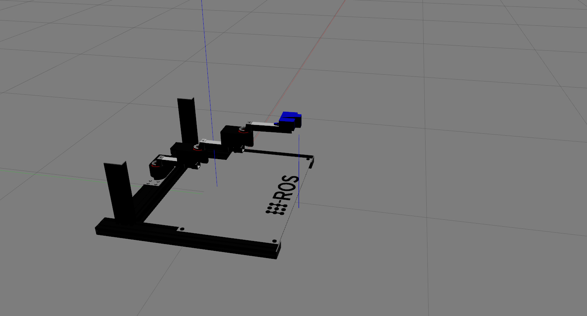

# An OpenAI gym extension for using Gazebo known as `gym-gazebo`

<!--[](https://travis-ci.org/erlerobot/gym)-->

This work presents an extension of the initial OpenAI gym for robotics using ROS and Gazebo. A whitepaper about this work is available at https://arxiv.org/abs/1608.05742. Please use the following BibTex entry to cite our work:

	@misc{1608.05742,
		Author = {Iker Zamora and Nestor Gonzalez Lopez and Victor Mayoral Vilches and Alejandro Hernandez Cordero},
		Title = {Extending the OpenAI Gym for robotics: a toolkit for reinforcement learning using ROS and Gazebo},
		Year = {2016},
		Eprint = {arXiv:1608.05742},
	}

-----

**`gym-gazebo` is a complex piece of software for roboticists that puts together simulation tools, robot middlewares (ROS, ROS 2), machine learning and reinforcement learning techniques. All together to create an environment whereto benchmark and develop behaviors with robots. Setting up `gym-gazebo` appropriately requires relevant familiarity with these tools.**

**Code is available "as it is" and currently it's not supported by any specific organization. Community support is available [here](https://github.com/erlerobot/gym-gazebo/issues). Pull requests and contributions are welcomed.**

-----

## Table of Contents
- [Environments](#environments)
- [Installation](#installation)
- [Usage](#usage)


## Environments
The following are some of the available gazebo environments:

| Name | Middleware | Description | Reward |
| ---- | ------ | ----------- | ----- |
| `GazeboModularScara3DOF-v1` | ROS | This environment present a modular SCARA robot with a range finder at its end pointing towards the workspace of the robot. The goal of this environment is defined to reach the center of the "H" from the "H-ROS" logo within the worspace. | TBD |
| `GazeboModularScara3DOF-v0` | ROS | This environment present a modular SCARA robot with a range finder at its end pointing towards the workspace of the robot. The goal of this environment is defined to reach the center of the "O" from the "H-ROS" logo within the worspace. |TBD |
| `GazeboCircuit2TurtlebotLidar-v0` | ROS | A simple circuit with straight tracks and 90 degree turns. Highly discretized LIDAR readings are used to train the Turtlebot. Scripts implementing **Q-learning** and **Sarsa** can be found in the _examples_ folder. | |
| `GazeboCircuitTurtlebotLidar-v0.png` | ROS | A more complex maze  with high contrast colors between the floor and the walls. Lidar is used as an input to train the robot for its navigation in the environment. | |
| `GazeboMazeErleRoverLidar-v0` | ROS, [APM](https://github.com/erlerobot/ardupilot) | **Deprecated** | |
| `GazeboErleCopterHover-v0` | ROS, [APM](https://github.com/erlerobot/ardupilot) | **Deprecated** |


## Installation
Refer to [INSTALL.md](INSTALL.md)

## Usage

### Build and install gym-gazebo

In the root directory of the repository:

```bash
sudo pip install -e .
```

### Running an environment

- Load the environment variables corresponding to the robot you want to launch. E.g. to load the Turtlebot:

```bash
cd gym_gazebo/envs/installation
bash turtlebot_setup.bash
```

Note: all the setup scripts are available in `gym_gazebo/envs/installation`

- Run any of the examples available in `examples/`. E.g.:

```bash
cd examples/scripts_turtlebot
python circuit2_turtlebot_lidar_qlearn.py
```

### Display the simulation

To see what's going on in Gazebo during a simulation, simply run gazebo client:

```bash
gzclient
```

### Display reward plot

Display a graph showing the current reward history by running the following script:

```bash
cd examples/utilities
python display_plot.py
```

HINT: use `--help` flag for more options.

### Killing background processes

Sometimes, after ending or killing the simulation `gzserver` and `rosmaster` stay on the background, make sure you end them before starting new tests.

We recommend creating an alias to kill those processes.

```bash
echo "alias killgazebogym='killall -9 rosout roslaunch rosmaster gzserver nodelet robot_state_publisher gzclient'" >> ~/.bashrc
```
