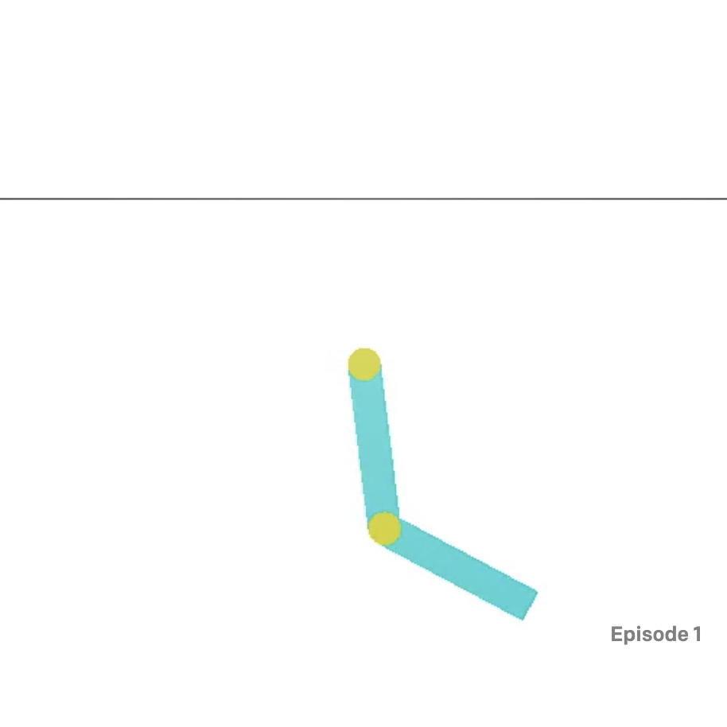

Acrobot-v1
---
|Title|Action Type|Action Shape|Action Values|Observation Type| Observation Shape|Observation Values|Average Total Reward|Import|
| ----------- | -----------| ----------- | -----------|-----------| ----------- | -----------| ----------- | -----------|
|Acrobot-v1|Discrete|(2,)|(0,1,2)| Box |(6,)|[(-1,1),(-1,1), (-1, 1), (-1, 1), (-12.567, 12.567), (-28.274, 28.274)]| |`from gym.envs.classic_control import acrobot`|

---

### Description
The Acrobot system includes two joints and two links, where the joint between the two links is actuated. Initially, the
links are hanging downwards, and the goal is to swing the end of the lower link up to a given height by applying changes
to torque on the actuated joint (middle).




**Image**: two blue pendulum links connected by two green joints. The joint in between the two pendulum links is acted 
upon by the agent via changes in torque. The goal is to swing the end of the outer-link to reach the target height 
(black horizontal line above system).

### Action Space

The action is either applying +1, 0 or -1 torque on the joint between the two pendulum links.

| Num | Action                 |
|-----|------------------------|
| 0   | apply -1 torque to the joint |
| 1   | apply 0 torque to the joint |
| 2   | apply 1 torque to the joint |

### Observation Space

The observation space gives information about the two rotational joint angles `theta1` and `theta2`, as well as their 
angular velocities:
- `theta1` is the angle of the inner link joint, where an angle of 0 indicates the first link is pointing directly 
downwards.
- `theta2` is *relative to the angle of the first link.* An angle of 0 corresponds to having the same angle between the 
two links.

The angular velocities of `theta1` and `theta2` are bounded at ±4π, and ±9π respectively.
The observation is a `ndarray` with shape `(6,)` where the elements correspond to the following:

| Num | Observation           | Min                  | Max                |
|-----|-----------------------|----------------------|--------------------|
| 0   | Cosine of `theta1`         | -1                 | 1                |
| 1   | Sine of `theta1`         | -1                 | 1                |
| 2   | Cosine of `theta2`            | -1 | 1 |
| 3   | Sine of `theta2`            | -1 | 1 |
| 4   | Angular velocity of `theta1` |        ~ -12.567 (-4 * pi)         |      ~ 12.567 (4 * pi)   |
| 5   | Angular velocity of `theta2` |        ~ -28.274 (-9 * pi)         |      ~ 28.274 (9 * pi)   |

or `[cos(theta1) sin(theta1) cos(theta2) sin(theta2) thetaDot1 thetaDot2]`. As an example, a state of 
`[1, 0, 1, 0, ..., ...]` indicates that both links are pointing downwards.

### Rewards

All steps that do not reach the goal (termination criteria) incur a reward of -1. Achieving the target height and 
terminating incurs a reward of 0. The reward threshold is -100.

### Starting State

At start, each parameter in the underlying state (`theta1`, `theta2`, and the two angular velocities) is initialized 
uniformly at random between -0.1 and 0.1. This means both links are pointing roughly downwards.

### Episode Termination
The episode terminates of one of the following occurs:

1. The target height is achieved. As constructed, this occurs when 
`-cos(theta1) - cos(theta2 + theta1) > 1.0`
2. Episode length is greater than 500 (200 for v0)

### Arguments

There are no arguments supported in constructing the environment. As an example:

```python
import gym
env_name = 'Acrobot-v1'
env = gym.make(env_name)
```

By default, the dynamics of the acrobot follow those described in Richard Sutton's book 
[Reinforcement Learning: An Introduction](http://incompleteideas.net/book/11/node4.html). However, a `book_or_nips` 
setting can be modified on the environment to change the pendulum dynamics to those described
in [the original NeurIPS paper](https://papers.nips.cc/paper/1995/hash/8f1d43620bc6bb580df6e80b0dc05c48-Abstract.html). 
See the following note and 
the [implementation](https://github.com/openai/gym/blob/master/gym/envs/classic_control/acrobot.py) for details:

> The dynamics equations were missing some terms in the NIPS paper which
        are present in the book. R. Sutton confirmed in personal correspondence
        that the experimental results shown in the paper and the book were
        generated with the equations shown in the book.
        However, there is the option to run the domain with the paper equations
        by setting `book_or_nips = 'nips'`

Continuing from the prior example:
```python
# To change the dynamics as described above
env.env.book_or_nips = 'nips'
```


### Version History

- v1: Maximum number of steps increased from 200 to 500. The observation space for v0 provided direct readings of 
`theta1` and `theta2` in radians, having a range of `[-pi, pi]`. The v1 observation space as described here provides the
sin and cosin of each angle instead.
- v0: Initial versions release (1.0.0) (removed from openai/gym for v1)

### References
- Sutton, R. S. (1996). Generalization in Reinforcement Learning: Successful Examples Using Sparse Coarse Coding. In D. Touretzky, M. C. Mozer, & M. Hasselmo (Eds.), Advances in Neural Information Processing Systems (Vol. 8). MIT Press. https://proceedings.neurips.cc/paper/1995/file/8f1d43620bc6bb580df6e80b0dc05c48-Paper.pdf
- Sutton, R. S., Barto, A. G. (2018 ). Reinforcement Learning: An Introduction. The MIT Press.
